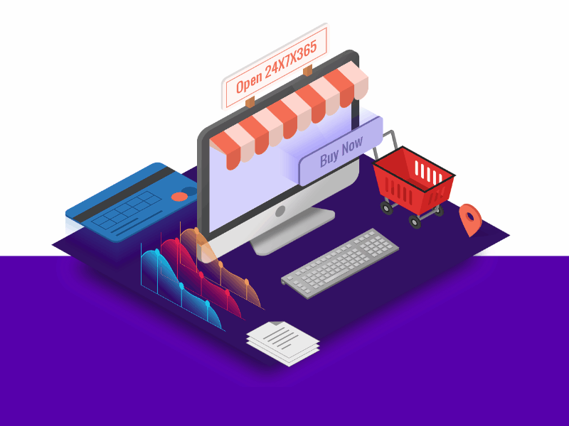

<p align="center">
    
    <h2 align="center">Ecommerce Analytics</h2>
    <p align="center"><a href="https://medium.com/@williamong1400/project-1-solving-problem-in-e-commerce-with-data-ac7ed38d7b4" target="_blank"></a>
    <a href="https://docs.google.com/presentation/d/1xpdKquP4t7rTqpr9T9dSZZaNkU5d6t6deJb6YQQo1Zc/edit?usp=sharing" target="_blank"></a>
    </p>
    
</p> 
<p align="center">A end to end data science project to learn about data engineering, data analysis and how machine learning can be used to solve the problem</b></p>

## Overview
This project is used as a method to learn more about data science workflow. From gathering needed data as data engineer, analyse what can be improved as data analyst and use machine learning as opportunities to automate certain task to improve our ecommerce system.

## Getting Started

1. Clone this repo (for help see this [tutorial](https://help.github.com/articles/cloning-a-repository/)).
2. Raw Data is being kept [here](https://drive.google.com/drive/folders/1EhdzxzMnBAIJyZU9aXpXrXs58gSnTMKU?usp=sharing) within this drive.
3. Data processing/transformation scripts are being kept [here](scripts)


## Data Warehouse Schema
[Link](https://dbdiagram.io/d/604272d1fcdcb6230b22cecc)

## Tech Stacks
* Python
* Pandas
* Sklearn
* Python Visualization Library (matplotlib, seaborn)

### Project Structure
```
root
├───bin              <- Trained and serialized models, model predictions, or model summaries
├───data             <- Raw and processed data
├───figure           <- Figure used for documentation
├───notebooks        <- Notebook for experimenting and finalizing results
├───reports          <- Reports from training model
├───src              <- Script to train models.
├───scripts          <- Source code for use in this project.
```

## ❤️ Support
If you feel that this repo have helped you provide more example on learning software engineering, then it is enough for me! Wanna contribute more? Please ⭐ this repo so other can see it too!
