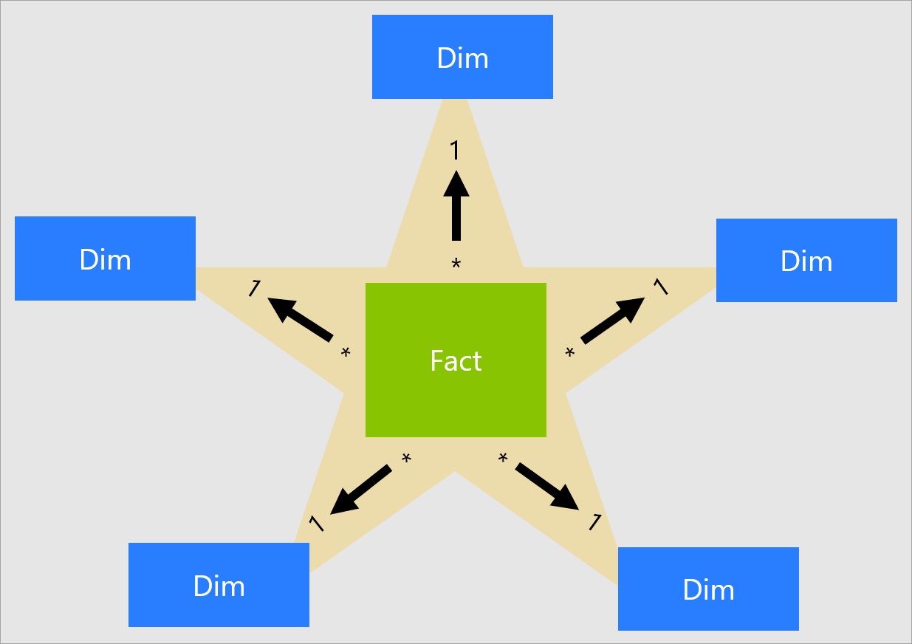

# Part 1 : Data Engineering

    

## Introduction
> Data engineering is a process to provide data in usable formats to the data analytics and data scientists who run queries to perform analytics and applying algorithms against the information for predictive analytics, machine learning and data mining applications.

<!-- Introduction & Usecase of data engineering -->

    

Why do we need to load the data into database? Why not store our data in files instead of a database and analyse it from the files?

    

To replicate the business process from an ecommerce, we will need database that **act** as a place to store data for day to day transactional process, while a warehouse will **act** as a place to store collehction of historical data for analyzing our ecommerce.

Not only that, most of the time data are not in the best shape for analysis. Without data engineering process, we would have to spend more time preparing data analysis to solve complex business problems. Thus, this part (**Part I**) is a process to make the data ready & available for analysis (**Part II**) and modelling (**Part III**)

<!-- Introduction to our project -->
In this part, we are going to discuss about how we are going to load dataset in `csv` format into Database Server (PostgresSQL) and designing Data Warehouse from it.

In short, we will discuss : 
1. **Identify** : Find the relation between dataset 
2. **Design** : Design OLTP & OLAP to load & analyze data
3. **Execute** : Load data into warehouse using ETL process

<!-- Ending Intro -->
This documentation provide the process & result of pipeline that I create & use for **Part 1**. 💪

<!-- TABLE OF CONTENTS -->
## Table of Contents
* [Prerequisites](#prerequisites)
* [Architecture Diagram](#architecture)
* [Database Diagram](#database)
* [Warehouse Diagram](#data-warehouse)
* [ETL](#etl-pipeline)
* [References](#references)

## Prerequisites
First of all, all data used for this project were **given** by our mentor (**primary data**). Dataset consists of 7 `csv` files.

**Dataset :**

No | Filename | Description |
---: | :---: | :--- |
1 | user_dataset.csv | dataset containing details of user
2  | order_dataset.csv | dataset containing information for an order
3 | order_item_dataset.csv | dataset containing information for each product from an order
4 | payment_dataset.csv | dataset containing information from each payment for an order
5 | products_dataset.csv | dataset containing details of product
6 | seller_dataset.csv | dataset containing details of seller
7 | feedback_dataset.csv | dataset containing information from each feedback for an order

For the project environment, please use : 
* [PostgresSQL v10.0](https://www.postgresql.org/about/news/postgresql-10-released-1786/) 
* [Python 3.8+ (pip)](https://www.python.org/)

## Architecture

What is the **pipeline structure** of this project?

    <h3>Pipeline Simplify</h3>
    

Above picture show the outline on what we are going to do to design & model **Data Warehouse** that we are going to use for **Part II** & **Part III**.

## Database

Let's talk about **database**. The data structure that were used in database is called relational model. It represents data as tables and relations among those tables.

Every row in the table called a record, every column is called a field.

    
    Sample Database Structure

 

After loading the `.csv` dataset into database, we need to **identify the relationship** between data.

**Datatype**
Type | Description | Storage
---: | :---: |:--- 
int | Allows whole numbers between -2,147,483,648 and 2,147,483,647 | 4 bytes
bool | Zero is considered as false, nonzero values are considered as true. | 1 bytes
varchar(max) | Variable width character string | 2 bytes + number of chars
float(n) | Floating precision number data from -1.79E + 308 to 1.79E + 308. | 4 or 8 bytes
timestamp | Stores a unique number that gets updated every time a row gets created or modified. | -

**Relationship Mapping**

No | Relation | Type | Key
---: | :---: | :---: |:--- 
1 | order - payment | **Many to One** | order_id
2 | order - user | **Many to Many** | user_name
3 | order - feedback | **One to Many** | order_id
4 | order - order item | **One to Many** | order_id
5 | order item - seller | **Many to One**  | seller_id
6 | order item - product | **Many to One** | product_id

After we map the relationship, we can make create & load the data into database. Here are the **schema** that we will use as our **database schema**.

    <h3>Transactional Database</h3>
    

## Data Warehouse

> The **data warehouse** is a specific infrastructure element that provides down-the-line users, including data analysts and data scientists, access to data that has been shaped to conform to business rules and is stored in an easy-to-query format.

The data must conform to specific business rules that validate quality. Then it is stored in a denormalized structure — *that means storing together pieces of information that will likely be queried together*. This serves to increase performance by decreasing the complexity of queries required to get data out of the warehouse (i.e., by reducing the number of data joins).

In order to answer the business question that we have (will be explained in **Part II**), we need to create a data warehouse schema that can provide information that we will use for **Part II** & **Part III**. We will use **star schema** for our warehouse. The granularity for our warehouse are **1 product for each order**, which means that for each row in *Fact Order Item* has the details for 1 product from an order.

Before we start, I would like to give an overview about concepts that we will using to model the data warehouse :
>**Star schema** is a mature modeling approach for data warehouse which requires modelers to classify their model tables as either dimension or fact.

>**Dimension tables** describe business entities—the things you model. Entities can include products, people, places, and concepts including time itself. The most consistent table you'll find in a star schema is a date dimension table. A dimension table contains a key column (or columns) that acts as a unique identifier, and descriptive columns.

>**Fact tables** store observations or events, and can be sales orders, stock balances, exchange rates, temperatures, etc. A fact table contains dimension key columns that relate to dimension tables, and numeric measure columns. The dimension key columns determine the dimensionality of a fact table, while the dimension key values determine the granularity of a fact table. 

**Dimension Table Details:**

No | Dimension | Description | Type 
---: | :---: |:--- | :---
1 | User Dimension | Provide information about user | **SCD II**
2 | Seller Dimension | Provide information about seller | **SCD II**
3 | Product Dimension | Provide information about product | **SCD II**
4 | Feedback Dimension | Provide information about feedback | **SCD II**
5 | Date Dimension | Addition dimension for adding context for dates, such as holiday and weekend  | **SCD 0**
6 | Time Dimension | Addition dimension for adding context for times  | **SCD 0**
7 | Geo Dimension | Addition dimension for adding context for location, such as lat and long | **SCD 0**

**Fact table Surogate Key Details:**
No | Dimension | Key 
---: | :---: |:--- 
1 | User Dimension | user_key
2 | Seller Dimension | seller_key
3 | Product Dimension | product_key
4 | Feedback Dimension | feedback_key

In **star schema** design, a **measure** is a fact table column that stores values to be summarized. Here, our fact table store 5 different types of measure from **each product from an order** : 
- Price
- Shipping cost
- Payment value
- User lifetime spending
- User lifetime order

    
    Data Warehouse Final Schema (End Result)

## ETL Pipeline
**(Extract → Transform → Load)**

To load data from our OLTP (Database) into OLAP (Data Warehouse) we need a pipeline for ETL. To do that, we need to create an ETL process for each dimension and fact table.

The image above lays out the processing structure for our etl pipeline.

Also, we use **PostgresSQL** for data storage, our transformation logic to move data from **A (OLTP) to B(OLAP)** is carried out using **SQL and Python** (no 3rd party tools).

**Data Sources:**
<table>
<thead>
<tr class="header">
<th><strong>Type</strong></th>
<th>Database (OLTP)</th>
</tr>
</thead>
<tbody>
<tr class="odd">
<td><strong>Authentication</strong></td>
<td>Username/Password (Admin)</td>
</tr>
<tr class="even">
<td><strong>Data</strong></td>
<td>Ecommerce Database</td>
</tr>
<tr class="even">
<td><strong>Documentation</strong></td>
<td>-</td>
</tr>
</tbody>
</table>

<table>
<thead>
<tr class="header">
<th><strong>Type</strong></th>
<th>Flat Files</th>
</tr>
</thead>
<tbody>
<tr class="odd">
<td><strong>Authentication</strong></td>
<td>NA</td>
</tr>
<tr class="even">
<td><strong>Data</strong></td>
<td><ol type="1">
<li>
Location  (CSV)
</li>
<li>
Time (CSV)
</li>
<li>
Date (CSV)
</li>
</ol></td>
</tr>
<tr class="even">
<td><strong>Documentation</strong></td>
<td>
<ul>
    <li><a href="https://simplemaps.com/data/id-cities">Cities Map</a></li>
    <li><a href="https://blog.crossjoin.co.uk/2015/06/26/automatically-generating-date-dimension-tables-in-excel-2016-power-pivot/">Datetime in excel</a></li>
</ul></td>
</tr>
</tbody>
</table>

## References
- [Quick Guide for Data Engineering](https://realpython.com/python-data-engineer/)
- [Importance of Data Engineering](https://www.analyticsvidhya.com/blog/2021/06/data-engineering-concepts-and-importance/)
- [Data Engineering Deep Dive](https://github.com/oleg-agapov/data-engineering-book)
- [Modelling Data Warehouse](https://towardsdatascience.com/data-warehouse-68ec63eecf78)
- [SCD (Slowly Changing Dimension)](https://github.com/MicrosoftDocs/powerbi-docs/blob/live/powerbi-docs/guidance/star-schema.md#slowly-changing-dimensions)
- [Measure in Fact Table]()

